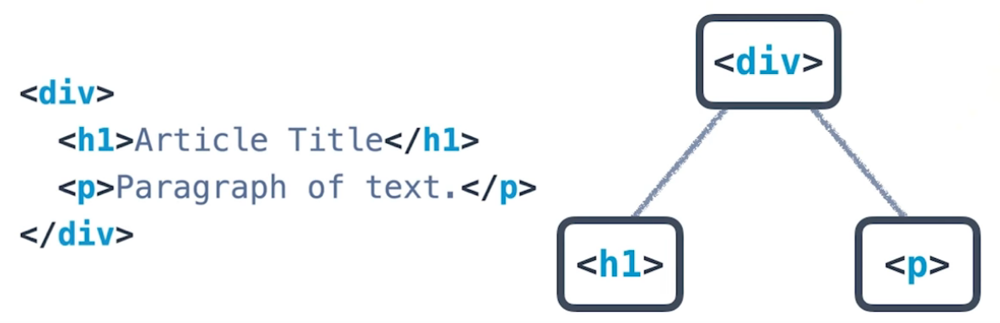

# UD001 - HTML Syntax - `Lesson01`

#### Tags

* Author:      : AH Uyekita
* Chapter      : HTML Syntax
* Start        : 21/12/2018
* Course Title : Intro to HTML and CSS
* COD          : UD001
    * **Instructor:** Cameron Pittman
    * **Instructor:** James Parkes

#### Requirements

Any text editor:

* Atom;
* Visual Studio;
* VIM;
* Emacs.

A web browser:

* Chrome;
* Firefox.

********************************************************************************

## HTML Syntax

This language use a concept of tags, which encapsulate contents.

```html
<tag> my content here! </tag>
```
Every time I open a tag I must close it (with some exceptions like the image tag). The definition of tag is by using the angle brackets.

### Tags

There are several tags in HTML, so I think it is better to access the [w3school][w3site] to learn more about.

[w3site]: https://www.w3schools.com/html/default.asp

* `<p>`: Paragraph;
* ``: Image;
* `<h1>`: Header 1 (it is biggest);
* `<br>`: break line, etc.
* `<em>`: Italic

[Element Reference - From Mozilla Dev][mozilla_dev] : This guide is very useful to find a short explanation of each kind of element.

[mozilla_dev]: https://developer.mozilla.org/en-US/docs/Web/HTML/Element

### Tree

We will use a tree to describe the relationship between the elements. Sometimes, a container will have a lot of elements and this element will have a hierarchy, which stands to parents and siblings. The Figure 1 shows this relation.



Bear in mind, to open a tag and close inside of the respect parent.

```html
<div>
    <p>my teste</p>
</div>
```

In the example above the `<p>` must be opened and closed inside of the `<div>` tag.

### HTML Document Structure

The HTML could be divided into three general parts:

>**DOCTYPE:** Describes the type of HTML. While there are technically different types, for 99.999% of the HTML you'll write, you’ll likely be fine with `<!DOCTYPE html>`.
>**`<head>`:** Describes meta information about the site, such as the title, and provides links to scripts and stylesheets the site needs to render and behave correctly.
>**`<body>`:** Describes the actual content of the site that users will see.

I have extracted this fragment from the class notes.

It is not necessary all these parts render an HTML file.

#### Body

The `<body>` is where the content lives

#### Head

The `<head>` allocates the configuration of the website (how could it be rendered, which CSS files is need, etc.).

#### Meta

The `<meta charset="utf-8">` is the standard and allow the website to display any Unicode character.

#### Title

The `<title>My Title</title>` will configure the name of the page that you will read in the browser navegation tab.
